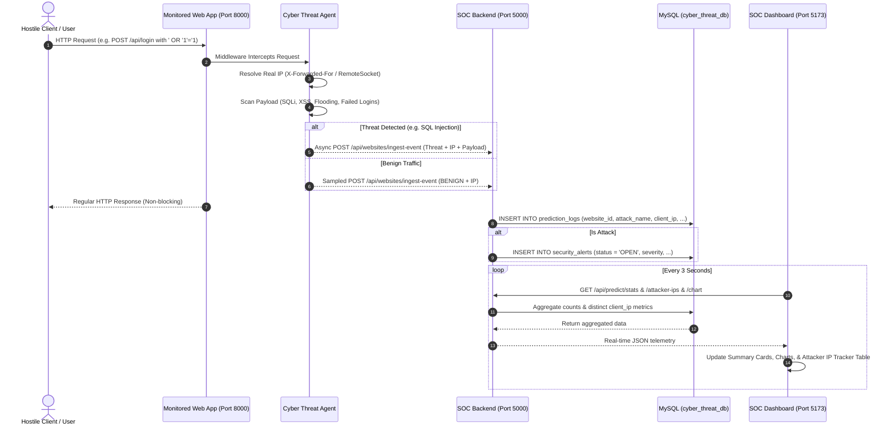
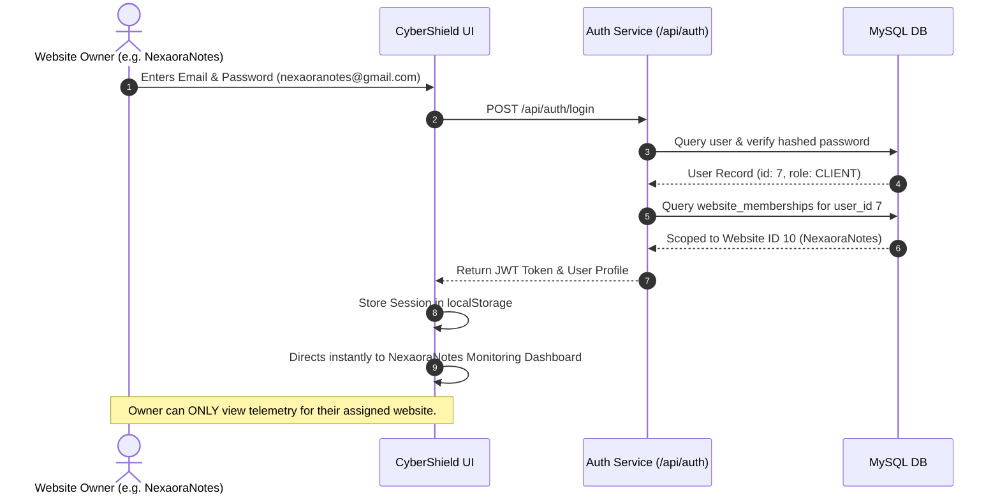

# 🛡️ CyberShield — Cyber Threat Detection & Security Analytics Platform

[](LICENSE)
[](https://nodejs.org/)
[](https://reactjs.org/)
[](https://vitejs.dev/)
[](https://www.mysql.com/)
[](https://tailwindcss.com/)
[](https://www.python.org/)

An enterprise-grade, real-time Security Operations Center (SOC) telemetry and intrusion detection platform designed to monitor production web applications, track hostile attacker source IPs, and classify incoming network traffic using a Hybrid Machine Learning (Random Forest + XGBoost) pipeline and signature-based heuristic agents.

---

## 📑 Table of Contents
1. [System Architecture](#-system-architecture)
2. [Data Flow Diagrams](#-data-flow-diagrams)
3. [Functional Requirements](#-functional-requirements)
4. [Non-Functional Requirements](#-non-functional-requirements)
5. [Database Schema & Data Model](#-database-schema--data-model)
6. [Attacker IP Tracking System](#-attacker-ip-tracking-system)
7. [External Monitored Site Integration (NexaoraNotes)](#-external-monitored-site-integration-nexaoranotes)
8. [Attack Simulation & Verification Script](#-attack-simulation--verification-script)
9. [Installation & Setup Guide](#-installation--setup-guide)
10. [Default Credentials](#-default-credentials)
11. [Project Directory Structure](#-project-directory-structure)

---

## 🏛️ System Architecture

CyberShield operates as a decoupled, multi-tier security analytics ecosystem:

```
┌────────────────────────────────────────────────────────┐
│             Monitored Target Applications              │
│   (e.g., NexaoraNotes - http://localhost:8000)         │
│   ┌────────────────────────────────────────────────┐   │
│   │           cyber_agent.js Middleware            │   │
│   │  • Non-blocking payload & header scanner       │   │
│   │  • Heuristics: SQLi, XSS, DoS, Brute-Force     │   │
│   │  • Attacker IP resolution (X-Forwarded-For)   │   │
│   └──────────────────────┬─────────────────────────┘   │
└──────────────────────────┼─────────────────────────────┘
                           │ Asynchronous HTTP Ingestion
                           ▼
┌────────────────────────────────────────────────────────┐
│                 SOC Backend (Node.js)                  │
│                http://localhost:5000                   │
│   ┌────────────────────────────────────────────────┐   │
│   │  • Telemetry Ingest Engine (/ingest-event)     │   │
│   │  • Threat Intelligence Aggregator              │   │
│   │  • Attacker IP Tracker (/attacker-ips)         │   │
│   │  • Scoped Tenant RBAC Authorization (JWT)      │   │
│   │  • Platform Self-Threat Sentinel               │   │
│   └───────────────┬─────────────────┬──────────────┘   │
└───────────────────┼─────────────────┼──────────────────┘
                    │                 │
     MySQL Storage  │                 │ ML Inference Bridge
     Port 3306      ▼                 ▼ Port 5001
 ┌──────────────────────┐    ┌───────────────────────────┐
 │   cyber_threat_db    │    │    Flask ML Microservice  │
 │  • prediction_logs   │    │  • Random Forest Engine   │
 │  • security_alerts   │    │  • XGBoost Classifier     │
 │  • monitored_websites│    │  • CICIDS2017 Preprocessor│
 │  • users             │    └───────────────────────────┘
 └──────────────────────┘
            ▲
            │ Live Polling & Telemetry Queries (every 3s)
            │
┌───────────┴────────────────────────────────────────────┐
│            CyberShield Frontend Dashboard              │
│                http://localhost:5173                   │
│   ┌────────────────────────────────────────────────┐   │
│   │  • CyberShield Clean Light UI                  │   │
│   │  • 4 Core Summary Cards (Live MySQL Metrics)   │   │
│   │  • Threat Donut & Attack Frequency Bar Charts  │   │
│   │  • Attacker IP Threat Tracker Table (Live)     │   │
│   │  • Prediction Inspection & Alerts View         │   │
│   └────────────────────────────────────────────────┘   │
└────────────────────────────────────────────────────────┘
```

---

## 🔄 Data Flow Diagrams

### 1. Real-Time Telemetry & Threat Ingestion Flow



### 2. Tenant Isolation & Scoped Authentication Flow



---

## ⚙️ Functional Requirements

### 1. Core Threat Detection & Telemetry Ingestion
- **Automated Signature & Anomaly Interception**:
  - **SQL Injection (SQLi)**: Detects UNION queries, boolean bypasses (`' OR '1'='1`), comment delimiters (`--`, `/*`), and tautologies.
  - **Cross-Site Scripting (XSS)**: Flags malicious tags (`<script>`, `<svg>`, `<iframe>`, `javascript:`, inline event handlers `onerror=`).
  - **Directory Traversal / Infiltration**: Detects relative directory escapes (`../`, `..\`), sensitive system file access (`/etc/passwd`, `win.ini`), and shell invocations.
  - **Brute-Force Detection**: Tracks 401 unauthorized login attempts per source IP within a sliding 3-minute window; flags automated credential attacks.
  - **DoS Slowhttptest / HTTP Flooding**: Sliding window frequency rate limiter flags request velocity exceeding 25 requests within 5 seconds per source IP.
  - **Vulnerability Scanner / Bot Fingerprinting**: Detects signature User-Agents (e.g., `sqlmap`, `nikto`, `nmap`, `dirbuster`, `metasploit`).

### 2. Attacker Source IP Tracking
- Captures and records hostile origin IP addresses across all attacks.
- Aggregates by `client_ip` to report:
  - Unique attack incident count per hostile IP.
  - Comma-delimited attack vector profile (e.g., `DoS Slowhttptest, Web Attack SQL Injection`).
  - Maximum severity rating (`CRITICAL`, `HIGH`, `MEDIUM`).
  - Target destination port (`8000`, `5000`).
  - Precise timestamp of the most recent malicious event.
  - Defense status indicator (`TRACKED & FLAGGED`).

### 3. Tenant Scoped Isolation & Access Control
- **Strict Single-Tenant Dashboard View**: When a website owner logs in (e.g., `nexaoranotes@gmail.com`), the dashboard automatically scopes all telemetry, charts, and IP tables strictly to their assigned website (`website_id: 10`).
- **Developer-Managed Website Governance**: Monitored targets are explicitly declared in code (`backend/config/monitoredWebsites.js`). No unauthorized web entities can be registered from public or frontend forms.

### 4. Interactive SOC Dashboard & Visualizations
- **4 Key Metric Cards**:
  1. *Total Predictions* (Total network events logged)
  2. *Benign Traffic* (Clean legitimate traffic with safety percentage)
  3. *Detected Attacks* (Intrusion alerts requiring SOC attention)
  4. *Unique Client IPs* (Distinct network client IPs detected)
- **Attack Breakdown Donut Chart**: Proportional distribution of identified threat categories.
- **Attack Frequency Bar Chart**: Comparative volume of top attack vectors.
- **Live Attacker IP Threat Tracker**: Dedicated tabular view of hostile IPs updated live every 3 seconds.
- **Prediction History & Alert Modals**: Full JSON parameter inspection for forensics.

---

## 🔒 Non-Functional Requirements

| Metric | Requirement | Implementation |
| :--- | :--- | :--- |
| **Performance** | Sub-10ms overhead on monitored sites | Asynchronous, non-blocking telemetry dispatch via fire-and-forget Node.js HTTP requests. |
| **Telemetry Polling** | Real-time live dashboard sync | 3000ms polling intervals with lightweight aggregated MySQL queries (`COUNT(DISTINCT)`). |
| **Security** | Secure authentication & zero injection | JWT tokens signed with SHA-256 secret; parameterized SQL queries everywhere; password hashing via `bcrypt`. |
| **High Availability** | Graceful degradation | Target sites run uninterrupted even if the SOC backend or database temporarily goes offline. |
| **Reliability** | Zero dummy data tolerance | Real database telemetry only; no simulated mock counts in production dashboards. |
| **Usability** | Enterprise CyberShield Theme | Light theme, high contrast text (`#1e293b`), semantic status badges (`Safe`, `Threats`, `Live`). |

---

## 🗄️ Database Schema & Data Model

Database: **`cyber_threat_db`** (MySQL 8.0+)

```sql
-- 1. Monitored Websites Registry
CREATE TABLE monitored_websites (
  id INT AUTO_INCREMENT PRIMARY KEY,
  name VARCHAR(255) NOT NULL,
  base_url VARCHAR(255) NOT NULL,
  is_self BOOLEAN DEFAULT FALSE,
  code VARCHAR(64) UNIQUE NOT NULL,
  description TEXT,
  status ENUM('ACTIVE', 'PAUSED') DEFAULT 'ACTIVE',
  created_at TIMESTAMP DEFAULT CURRENT_TIMESTAMP
);

-- 2. Scoped Website Memberships
CREATE TABLE website_memberships (
  id INT AUTO_INCREMENT PRIMARY KEY,
  user_id INT NOT NULL,
  website_id INT NOT NULL,
  role ENUM('OWNER', 'ANALYST') DEFAULT 'OWNER',
  created_at TIMESTAMP DEFAULT CURRENT_TIMESTAMP,
  FOREIGN KEY (user_id) REFERENCES users(id) ON DELETE CASCADE,
  FOREIGN KEY (website_id) REFERENCES monitored_websites(id) ON DELETE CASCADE
);

-- 3. Telemetry Prediction Logs
CREATE TABLE prediction_logs (
  id INT AUTO_INCREMENT PRIMARY KEY,
  website_id INT NOT NULL,
  attack_name VARCHAR(100) NOT NULL,
  prediction INT NOT NULL,
  confidence FLOAT DEFAULT 0.98,
  client_ip VARCHAR(64) DEFAULT '127.0.0.1',
  destination_port INT DEFAULT 8000,
  severity VARCHAR(32) DEFAULT 'Low',
  created_at TIMESTAMP DEFAULT CURRENT_TIMESTAMP,
  FOREIGN KEY (website_id) REFERENCES monitored_websites(id) ON DELETE CASCADE
);

-- 4. High-Priority Security Alerts
CREATE TABLE security_alerts (
  id INT AUTO_INCREMENT PRIMARY KEY,
  website_id INT NOT NULL,
  alert_type VARCHAR(100) NOT NULL,
  severity ENUM('LOW', 'MEDIUM', 'HIGH', 'CRITICAL') DEFAULT 'HIGH',
  title VARCHAR(255) NOT NULL,
  details JSON,
  status ENUM('OPEN', 'ACKNOWLEDGED', 'RESOLVED') DEFAULT 'OPEN',
  created_at TIMESTAMP DEFAULT CURRENT_TIMESTAMP,
  FOREIGN KEY (website_id) REFERENCES monitored_websites(id) ON DELETE CASCADE
);
```

---

## 🎯 Attacker IP Tracking System

When attacks occur, the backend groups hostile events via `backend/routes/predict.js`:

```sql
SELECT 
  client_ip,
  COUNT(*) AS attack_count,
  GROUP_CONCAT(DISTINCT attack_name ORDER BY attack_name SEPARATOR ', ') AS attack_types,
  MAX(severity) AS severity,
  MAX(created_at) AS last_seen,
  destination_port
FROM prediction_logs
WHERE website_id = ? AND attack_name <> 'BENIGN'
GROUP BY client_ip, destination_port
ORDER BY last_seen DESC
LIMIT 50;
```

This ensures instant attribution of hostile bots, Tor exit nodes, and credential attackers.

---

## 🔌 External Monitored Site Integration (NexaoraNotes)

To integrate any external Node.js / Express application with CyberShield, embed the lightweight agent middleware:

```javascript
// In your target web app's server.js (e.g. NexaoraNotes):
const express = require('express');
const cyberThreatAgent = require('./cyber_agent');

const app = express();

// Mount BEFORE all routes to intercept and inspect every request
app.use(cyberThreatAgent);

app.use(express.json());
// ... your existing routes
app.listen(8000);
```

The agent scans all incoming payloads and sends non-blocking telemetry reports to:
`http://localhost:5000/api/websites/ingest-event`

---

## 🧪 Attack Simulation & Verification Script

The test script `test_security.js` located in `E:\Projects\nexaoranotes\test_security.js` validates real traffic and attack interception across distinct source IPs:

| Test # | Attack Vector | Simulated Source IP | Target Route | Expected Classification |
| :---: | :--- | :--- | :--- | :--- |
| **1** | Benign User Traffic | `192.168.1.105` | `GET /`, `POST /api/feedback` | `BENIGN` (Safe) |
| **2** | SQL Injection | `185.220.101.5` | `POST /api/login` (`' OR '1'='1`) | `Web Attack SQL Injection` |
| **3** | Stored/Reflected XSS | `103.251.167.22` | `POST /api/contact` (`<script>`) | `Web Attack XSS` |
| **4** | Brute-Force Auth | `45.155.205.233` | Multiple 401s on `/api/login` | `Web Attack Brute Force` |
| **5** | DoS HTTP Flood | `91.240.118.172` | 30 rapid parallel requests | `DoS Slowhttptest` |

To run the verification suite:
```powershell
cd E:\Projects\nexaoranotes
node test_security.js
```

---

## 🚀 Installation & Setup Guide

### Prerequisites
- **Node.js**: v18.0.0 or higher
- **MySQL Server**: v8.0 or higher
- **Python**: v3.10+ (for Machine Learning microservice)

### Step 1: Clone the Repository
```bash
git clone https://github.com/pinku1502/cyberThreatDetectionDashboard.git
cd cyberThreatDetectionDashboard
```

### Step 2: Configure Database & Backend
1. Create MySQL database:
   ```sql
   CREATE DATABASE cyber_threat_db;
   ```
2. Navigate to `backend/` and configure `.env`:
   ```env
   PORT=5000
   DB_HOST=localhost
   DB_USER=root
   DB_PASSWORD=your_mysql_password
   DB_NAME=cyber_threat_db
   JWT_SECRET=your_jwt_super_secret_key
   ML_SERVICE_URL=http://localhost:5001/predict
   ```
3. Install dependencies and start the backend:
   ```bash
   cd backend
   npm install
   node server.js
   ```

### Step 3: Start the Frontend Dashboard
```bash
cd ../frontend
npm install
npm run dev
```
The dashboard will be available at **`http://localhost:5173`**.

### Step 4: (Optional) Start Python ML Service
```bash
cd ../ml
pip install -r requirements.txt   # flask, scikit-learn, xgboost, pandas, numpy
python app.py
```

---

## 🔑 Default Credentials

| Portal / Website | Email | Password | Assigned Scope |
| :--- | :--- | :--- | :--- |
| **NexaoraNotes Owner** | `nexaoranotes@gmail.com` | `password123` | Scoped exclusively to **NexaoraNotes** |
| **CyberShield Platform Admin** | `admin@cybershield.com` | `Admin@123456` | Platform-wide monitoring |

---

## 📂 Project Directory Structure

```
cyberThreatDetectionDashboard/
├── backend/
│   ├── config/
│   │   ├── db.js                     # MySQL connection pool
│   │   └── monitoredWebsites.js      # Developer-configured website registry
│   ├── middleware/
│   │   ├── auth.js                   # JWT authentication middleware
│   │   ├── selfThreatMonitor.js      # Platform self-protection sentinel
│   │   └── websiteAccess.js          # Tenant isolation validator
│   ├── routes/
│   │   ├── auth.js                   # User login & profile routes
│   │   ├── predict.js                # Prediction logs, stats, & attacker IPs
│   │   └── websites.js               # Telemetry ingestion (/ingest-event)
│   ├── services/
│   │   ├── attackSamples.js          # Attack vectors library
│   │   ├── authService.js            # User authentication logic
│   │   └── monitoredWebsiteSync.js   # Database auto-sync on startup
│   ├── package.json
│   └── server.js                     # Express application entry point
├── frontend/
│   ├── src/
│   │   ├── api/
│   │   │   └── api.js                # Axios instance with auth interceptors
│   │   ├── components/
│   │   │   ├── AlertsPage.jsx        # Security alerts list view
│   │   │   ├── AttackBarChart.jsx    # Threat frequency column chart
│   │   │   ├── AttackPieChart.jsx    # Threat proportion donut chart
│   │   │   ├── AttackerIpTracker.jsx # Real-time hostile IP tracking table
│   │   │   ├── Login.jsx             # Clean tenant login screen
│   │   │   ├── Navbar.jsx            # Top status bar & user profile
│   │   │   ├── PredictionDetails.jsx # Detailed log inspection modal
│   │   │   ├── PredictionTable.jsx   # Historical prediction logs table
│   │   │   ├── RunPredictionButton.jsx # Manual prediction runner
│   │   │   ├── Sidebar.jsx           # CyberShield navigation sidebar
│   │   │   ├── SummaryCards.jsx      # 4 core metric cards
│   │   │   └── WebsiteSelector.jsx   # Active monitored website indicator
│   │   ├── App.jsx                   # Main layout and route controller
│   │   └── main.jsx                  # React DOM bootstrap
│   ├── package.json
│   └── vite.config.js
├── ml/
│   ├── app.py                        # Flask prediction API
│   ├── hybrid_classifier.py          # Random Forest + XGBoost ensemble
│   └── saved_model/                  # Trained model checkpoints
└── README.md                         # Comprehensive documentation
```

---

## 📄 License
This project is licensed under the **MIT License**.
